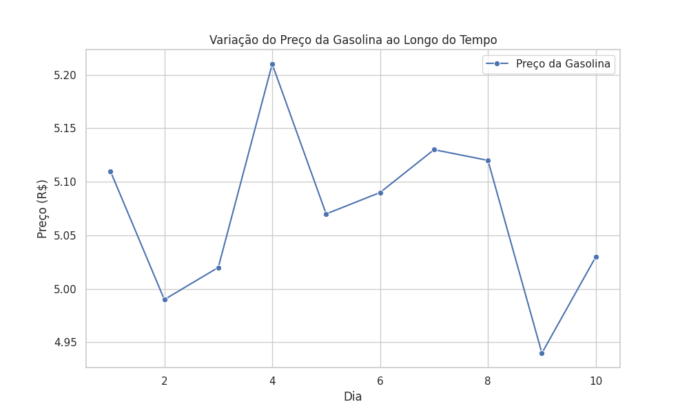

# Praticando Módulo 18 (Exercício EBAC - Analista de Dados)

<h2 align="center">Instalar bibliotecas</h2>

  Utilizaremos as seguintes bibliotecas: <code>Pandas</code>, <code>Matplotlib</code>, <code>Seaborn</code>.

<h2 align="center">Baixar arquivo csv</h2>

  Para iniciar, faça o download do arquivo de dados: [gasolina.csv](gasolina.csv)

<h2 align="center">Executar o código</h2>

  Execute o script Python para análise dos dados: [gasolina.py](gasolina.py)

<h2 align="center">Visualizar o gráfico:</h2>

  Veja o gráfico gerado a partir dos dados: 

